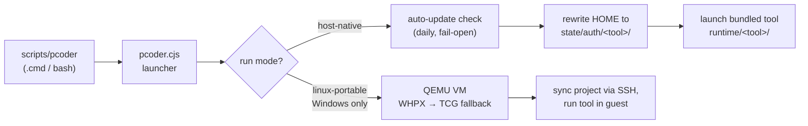

<div align="center">

# 🧳 PortableCoder

### A portable launcher for AI coding CLIs — copy the folder, run anywhere

**Claude Code and OpenAI Codex on any Windows, macOS, or Linux machine — or a flash drive — with no system-wide install.**

[](https://github.com/mjenkinsx9/portablecoder/actions/workflows/ci.yml)


[](LICENSE)

</div>

---

PortableCoder bundles a portable Node.js runtime and the selected tool's npm package inside one self-contained folder. Credentials are stored portably inside the folder (no registry writes, no system config, no admin rights), so the whole thing travels — USB stick, network share, or a plain copy to a new machine.

> **Supported tools:** [Claude Code](https://docs.anthropic.com/en/docs/claude-code) and [OpenAI Codex CLI](https://github.com/openai/codex). More can be added via `scripts/adapters/catalog.json` — [no code changes required](#-adding-a-tool).

## ✨ What's inside

| 🚀 Portable runtime | 🔐 Portable auth | 🔄 Auto-updates | 🛡️ VM mode |
|---|---|---|---|
| Bundled Node.js + tool installs under `runtime/` — no system Node needed after first bootstrap | OAuth credentials live in `state/auth/<tool>/` and travel with the folder | Daily npm check at launch, fail-open when offline, safe reinstall path | Optional QEMU Linux VM on Windows for isolated runs (Claude only) |

## 🚀 Quick start

### 1 · Bootstrap (first time only)

The first run needs Node.js available on the machine to execute the bootstrap (the bootstrap itself downloads a portable Node.js into `runtime/node/`, verified against the official SHA-256 checksums). After that, every run uses the bundled Node — the folder can be copied to a machine with no Node at all.

```bat
:: Windows
scripts\pcoder setup --init
scripts\pcoder runtime bootstrap-host-native --tool all
```

```bash
# Linux / macOS
scripts/pcoder setup --init
scripts/pcoder runtime bootstrap-host-native --tool all
```

This downloads a portable Node.js and installs the requested tools into the folder (~50 MB per tool). Pass `--tool claude` or `--tool codex` to install just one. Run `scripts\pcoder doctor` afterwards to verify — it reports the resolved runner for every supported tool.

### 2 · Authenticate

```bat
scripts\pcoder auth login                  :: Claude Code (default) — Anthropic OAuth
scripts\pcoder auth login --tool codex     :: OpenAI Codex — ChatGPT account or API key
```

Each login runs the tool's own `login` flow with `HOME` rewritten to a portable directory, so credentials land under `state/auth/<tool>/host/home/` (gitignored) instead of your user profile. `pcoder auth status` shows the state for every tool.

### 3 · Launch

```bat
scripts\pcoder                             :: default tool, current directory
scripts\pcoder codex                       :: a specific tool
scripts\pcoder run --project C:\my-project :: a specific project folder
scripts\pcoder claude -p "explain this codebase"
```

After a tool name, remaining arguments are forwarded as-is — no `--` separator needed unless an argument collides with a `pcoder` flag (`--project`, `--mode`, `--tool`, `--no-sync-back`). On Linux/macOS use `scripts/pcoder` with forward slashes.

## ⚙️ How it works



`scripts/adapters/catalog.json` is the source of truth for tool dispatch: every entry with an `npm_package` becomes a launchable tool, with its own env vars, config directory, and auth wiring resolved from the catalog at startup.

## 🧭 Run modes

| Mode | How it works | File access | Tools | Setup |
|---|---|---|---|---|
| **host-native** (default) | Runs the tool directly on the host via bundled Node.js | Full host filesystem | claude, codex | `runtime bootstrap-host-native` |
| **linux-portable** | Runs the tool inside a QEMU Linux VM | Synced project directory only | claude only | `runtime bootstrap` |

On Windows, the configured `windows_default_mode` is used unless an auto-fallback applies: host-native is preferred when the bundled tool runtime exists (no VM startup cost), and forced when the tool's catalog entry has `vm_supported: false` (currently codex). On Linux/macOS, host-native is always used; `linux-portable` there reuses the same isolated-auth wiring without a VM.

```bat
scripts\pcoder setup --windows-mode linux-portable   :: change the default
scripts\pcoder run --mode linux-portable             :: override one session
scripts\pcoder setup --default-tool codex            :: pick a default tool
```

## 🔄 Keeping tools updated

### Automatic updates

By default, `pcoder` checks npm for a newer version of the bundled tool at most once per 24 hours when launching it in host-native mode (3-second timeout; if the registry is unreachable the installed version launches immediately). When an update is found it is installed via the safe bootstrap path before the tool starts.

```bat
scripts\pcoder setup --auto-update false   :: disable permanently
set PCODER_AUTO_UPDATE=0                   :: disable for one invocation
```

### Manual updates

Use the bootstrap with `--force` — it pulls the latest version published to npm and writes cleanly into `runtime/<tool>/`:

```bat
scripts\pcoder runtime bootstrap-host-native --tool all --force
```

> **Warning:** Do **not** use the tools' built-in self-updaters (`claude --update`, `codex update`, …) on a pcoder install. They rewrite their own binary in place, and the bundled install hardlinks that binary across two locations — an interrupted update breaks the next launch. `pcoder` refuses these invocations; set `PCODER_ALLOW_TOOL_UPDATE=1` to bypass (not recommended).

## 🔐 Authentication

Each tool tracks its own auth mode (`oauth` or `api`).

**OAuth (default)** — credentials are written to `state/auth/<tool>/host/` and travel with the folder. Nothing is stored in system directories.

**API key mode** — keys are injected from environment variables at launch and never written to disk by PortableCoder:

```bat
scripts\pcoder setup --claude-auth api
set ANTHROPIC_API_KEY=sk-ant-...
scripts\pcoder
```

> `ANTHROPIC_AUTH_TOKEN` is accepted as an alias for `ANTHROPIC_API_KEY`. Codex uses `OPENAI_API_KEY`.

## 🛡️ VM mode (Windows, Claude only)

Runs Claude Code inside a self-contained QEMU Linux VM for environments where host-native execution isn't wanted. The tool has no direct host file access — project files sync in and out over SSH. Uses WHPX acceleration when available, falling back to software emulation (TCG).

```bat
scripts\pcoder runtime bootstrap          :: one-time: QEMU + Ubuntu image (~1 GB, SHA-256 verified)
scripts\runtime\windows\smoke-check.cmd   :: optional: verify the VM boots
scripts\pcoder run --mode linux-portable  :: launch
```

### Bypassing approvals (advanced)

Both tools expose flags that disable their interactive approval prompts. These are forwarded as-is — `pcoder` does not parse, gate, or persist them.

```bat
scripts\pcoder claude --dangerously-skip-permissions
scripts\pcoder codex --dangerously-bypass-approvals-and-sandbox
```

> **Warning:** these flags let the model run shell commands and modify files without asking. Anything your user account can do, the model can do. Use only in throwaway directories or VMs where the blast radius is contained.

## 📖 Command reference

| Command | Description |
|---|---|
| `pcoder` | Launch the default tool in the current directory |
| `pcoder <tool> [args...]` | Launch a specific tool (e.g. `pcoder codex`) |
| `pcoder doctor` | Check environment health |
| `pcoder setup --init` | Initialize `state/settings.json` with defaults |
| `pcoder setup --show` | Print current settings |
| `pcoder setup --default-tool <claude\|codex>` | Change the default tool |
| `pcoder setup --claude-auth <oauth\|api>` | Change Claude authentication mode |
| `pcoder setup --codex-auth <oauth\|api>` | Change Codex authentication mode |
| `pcoder setup --windows-mode <linux-portable\|host-native>` | Change Windows run mode |
| `pcoder setup --auto-update <true\|false>` | Enable/disable automatic updates |
| `pcoder setup --sync-back <true\|false>` | Control whether VM files sync back after a run |
| `pcoder auth status` | Show authentication status for all tools |
| `pcoder auth login\|logout [--tool <name>]` | Log in / out via OAuth |
| `pcoder runtime probe` | Show available runtime backends |
| `pcoder runtime bootstrap [--force]` | Download VM runtime (QEMU + Ubuntu) |
| `pcoder runtime bootstrap-host-native [--tool <name\|all>] [--force]` | Download Node.js + tool(s) |
| `pcoder run [--tool <name>] [--project <path>] [--mode <mode>] [-- <tool args>]` | Full launch control |

### Environment variables

| Variable | Purpose |
|---|---|
| `ANTHROPIC_API_KEY` / `ANTHROPIC_AUTH_TOKEN` | Claude API key (api auth mode) |
| `OPENAI_API_KEY` | Codex API key (api auth mode) |
| `ANTHROPIC_BASE_URL` / `OPENAI_BASE_URL` | Override API base URLs |
| `PCODER_CLAUDE_CMD` / `PCODER_CODEX_CMD` | Override the resolved tool command |
| `PCODER_AUTO_UPDATE` | Set to `0` to skip the automatic update check for one invocation |
| `PCODER_ALLOW_TOOL_UPDATE` | Set to `1` to allow the tools' native self-updaters (not recommended) |
| `PCODER_VM_SSH_TIMEOUT_SECONDS` | Max seconds to wait for VM SSH (default: 300) |
| `PCODER_VM_HOST` / `PCODER_VM_USER` / `PCODER_VM_SSH_KEY` | VM SSH connection overrides |
| `PCODER_VM_PROJECTS_ROOT` | Remote path for synced projects |
| `PCODER_SSH_CMD` | Override SSH client path |
| `HTTP_PROXY` / `HTTPS_PROXY` / `NO_PROXY` | Proxy settings forwarded into the VM |

## 📁 Repository layout

```
PortableCoder/
  scripts/
    pcoder.cmd / pcoder        ← Windows / POSIX entry points
    pcoder.cjs                 ← launcher logic (Node.js, cross-platform)
    lib/paths.cjs              ← shared path helpers
    adapters/catalog.json      ← tool adapter definitions (claude, codex, …)
    runtime/
      bootstrap-host-native.cjs  ← downloads Node + tools, verifies checksums
      windows/                   ← QEMU VM helper scripts
      linux/smoke-check.sh       ← Linux smoke test
  tests/                       ← unit tests (node:test, zero dependencies)
  runtime/                     ← bundled binaries (gitignored, travels with the folder)
  state/                       ← settings, auth, VM state (gitignored)
  docs/                        ← design specs and implementation plans
```

## 🧩 Adding a tool

`scripts/adapters/catalog.json` drives everything. To add a new CLI: add an entry with `npm_package`, `bin_name`, `candidate_commands`, `command_env`, `config_dir_name`/`config_dir_env`, `auth_env_vars`, `api_key_env`, and `vm_supported`, then run `pcoder runtime bootstrap-host-native --tool <name>`. No code changes needed — the launcher treats every catalog entry with an `npm_package` as launchable.

## 🔒 Security

- **OAuth credentials** are stored in gitignored `state/auth/<tool>/` — never committed, never written to system directories.
- **API keys** are passed via environment variables and never written to disk by PortableCoder.
- **Downloads are verified**: Node.js against `SHASUMS256.txt`, the Ubuntu VM image against `SHA256SUMS`, the QEMU installer against its SHA-512. A failed verification removes the artifact rather than leaving it to be trusted later.
- **Host-native mode** gives the tool the same file access as any program you run; **VM mode** confines it to explicitly synced files.
- CI runs [gitleaks](https://github.com/gitleaks/gitleaks) on every push.

## 🔬 Development process

This codebase is developed with Claude Code using a spec → plan → review loop: design documents live in [`docs/superpowers/specs/`](docs/superpowers/specs/), implementation plans in [`docs/superpowers/plans/`](docs/superpowers/plans/), and every change lands through CI that runs the unit suite, bootstraps both tools for real, and executes the smoke test — no masked failures.

```bash
npm test          # unit tests (node:test, no dependencies)
scripts/pcoder doctor
```

## 🤝 Contributing

Issues and PRs welcome. Before submitting: `npm test`, `npx prettier --check "scripts/**/*.cjs" "tests/**/*.cjs"`, and make sure `scripts/pcoder doctor` passes. PRs get an automated review plus the full CI gate.

## 📄 License

[MIT](LICENSE) © 2026 Mike Jenkins

---

<div align="center">
<sub>Built with <a href="https://claude.com/claude-code">Claude Code</a> · Bundle it, copy it, code anywhere 🧳</sub>
</div>
